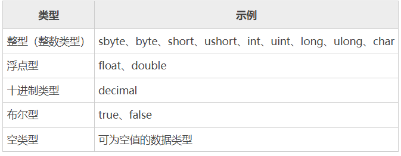

# C#变量
	变量可以理解为是我们程序可以操作的内存区域的名称，
	在 C# 中每个变量都有自己特定的类型，这个类型确定了变量所占内存的大小、布局、取值范围以及可以对该变量执行的操作。


## 声明变量
C# 中声明变量的语法格式如下所示：
```C#
data_type variable_list;
```

C# 中变量的名称并不是可以随意定义的，需要遵循如下所示的规则：

    变量名中可以包含英文字母a-z, A-Z、数字0-9和下划线_；
    变量名只能以英文字母a-z, A-Z或下划线_开头，不能以数字开头；
    变量名中不允许使用空格；
    变量名不能是任何 C# 中的保留字或关键字，例如 char、float 等。
## 初始化变量
C# 中变量可以通过等号后跟一个常量表达式的形式进行初始化（赋值），语法格式如下：
```C# 
variable_name = value;
```
也可以在变量声明时直接进行初始化，只需要在声明变量后使用等号后跟一个常量表达式即可，语法格式如下：
```c#
data_type variable_name = value;
```
```c#

using System;
namespace c.biancheng.net{
    class Program {
        static void Main(string[] args) {
            short a;
            int b ;
            double c;
            /* 初始化变量 */
            a = 10;
            b = 20;
            c = a + b;
            Console.WriteLine("a = {0}, b = {1}, c = {2}", a, b, c);
            Console.ReadLine();
        }
    }
}
```

编译并执行上述代码，运行结果如下：
a = 10, b = 20, c = 30


```c#
using System;
namespace c.biancheng.net{
    class Program {
        static void Main(string[] args) {
            int a, b;
            Console.WriteLine("请输入第一个数字：");
            //它是由 System 命名空间中的 Console 类提供的，使用 ReadLine() 函数可以接受来自用户输入的内容并将其存储到变量中。
            a = Convert.ToInt32(Console.ReadLine());
            Console.WriteLine("请输入第二个数字：");
            b = Convert.ToInt32(Console.ReadLine());
            Console.WriteLine("{0}+{1}={2}", a, b, a+b);
        }
    }
}

```

    因为使用 Console.ReadLine() 接收的数据是字符串格式的，所以示例中我们需要使用 Convert.ToInt32() 函数来将用户输入的数据转换为 int 类型。
## C# 中的 Lvalues 和 Rvalues 表达式
    C# 中有两种表达式，分别是 Lvalues 表达式和 Rvalues 表达式。Lvalues 和 Rvalues 一般是使用等号=进行分隔的，等号左边的叫 Lvalues， 等号右边的叫 Rvalues。
    Lvalues：又称左值，左值表达式可以出现在赋值语句的左边或右边；
    Rvalues：又称右值，右值表达式只可以出现在赋值语句的右边。

变量名是 Lvalues 的，所以可以出现在赋值语句的左边，而数值是 Rvalues 的，因此不能被赋值，不能出现在赋值语句的左边。下面就是一条有效的语句：
int age = 27;

而下面这条语句则是无效的，会导致编译错误：
123 = 321;